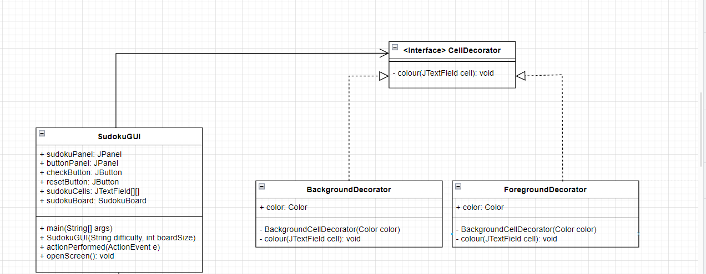

# Decorator Design Pattern for Sudoku

## What is the Decorator Design Pattern?

### **Benefits to the Decorator Design Pattern:**
 
## How is it used in the Sudoku Program?

## Why have we used it?

# UML

