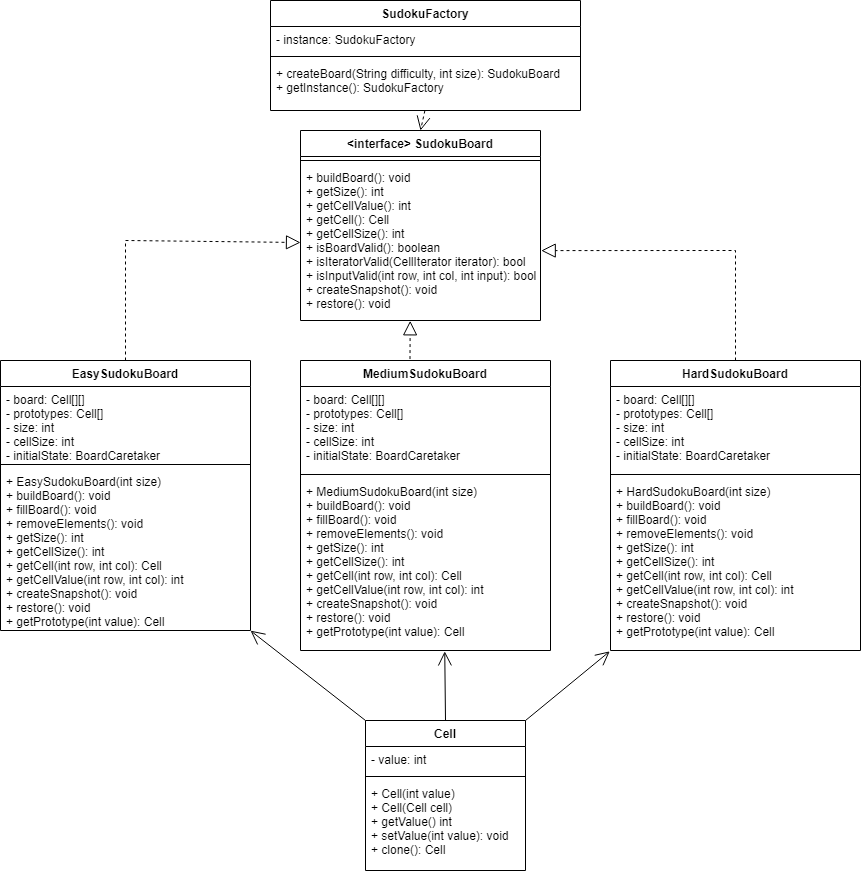

# Factory Design Pattern for Sudoku

## What is the Factory Design Pattern?
The factory design pattern is a creational design pattern used to define an interface for creating objects from a superclass, but allows for the subclasses to determine the objects they would like to instantiate. The factory method separates the responsibility of creating objects from the client code, and provides a centralized class for creating objects of different types. This is especially useful when at runtime the type of object to be created is now known, or the creation logic is complex. 
### **Benefits to the Factory Design Pattern:**
- Promotes loose coupling between the creator and concrete products
- Supports the Single Responsibility Principle
  - Object creation code can be placed into a single place
- Supports the Open-Closed Principle
  - New Objects can be introduced to the factory without needing to update the rest of the code

## How is it used in the Sudoku Program?
In the Sudoku program the Factory design pattern is used to create different types of Sudoku boards. Currently, there are three types of boards, easy, medium and hard, which are determined by the factory by the difficulty indicated in the client code when createBoard is called. The boards are created by using the difficulty to determine the type of board, and the size to determine the size of the board, at that difficulty. This could be further expanded with new types of boards in the future through simple modification of the createBoard method and the addition of new Boards.
### **SudokuFactory Code**
```java
public class SudokuFactory {
    private static SudokuFactory instance;
    private SudokuFactory(){}
    
    public static SudokuFactory getInstance(){
        if(instance == null){
            instance = new SudokuFactory();
        }
        return instance;
    }

    public SudokuBoard createBoard(String difficulty, int size){
        if(difficulty.equals("Easy")){
            return new EasySudokuBoard(size);
        }
        else if(difficulty.equals("Medium")){
            return new MediumSudokuBoard(size);
        }
        else if(difficulty.equals("Hard")){
            return new HardSudokuBoard(size);
        }
        else{
            return null;
        }
    }
}

```


## Why have we used it?
**Modularity**
- The use of the factory method increases the modularity of the program. The factory method supports the Open-closed principle, meaning we could introduce new types of sudoku puzzles easily to the system. There are currently only three types of boards, easy, medium and hard, but this could easily be expanded with more difficulties, or special sudoku challenges. 

**Reusability**
- The use of the factory method increases the reusability of the system. Objects of different types can be creates using the common SudokuBoard interface, this allows for more SudokuBoards to be created in the future, which can be created easily in the game using the SudokuFactory class

**Encapsulation**
- The factory pattern encapsulates the SudokuBoard creation logic into the factory class, which assists in seperation of responsibilities, as well as promoting modularity.

**Abstraction**
- The factory pattern allows the client to interact with the SudokuFactory for object creation, rather than needing to interact with several concrete products to create game boards. The introduction of the factory pattern promotes loose coupling and flexibility.


# UML

