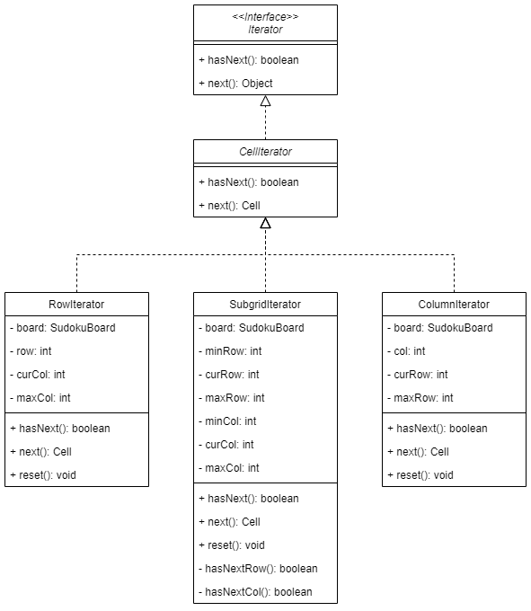

# Iterator Design Pattern for Sudoku

## What is the Iterator Design Pattern?

The Iterator design pattern is a behavioural pattern that allows elements of an underlying data structure (such as a sudoku board) to be traversed without exposing that underlying structure.

### Benefits

- Single Responsibility Principle - you can clean up the client code and the collections by extracting bulky traversal algorithms into separate classes.
- Open/Closed Principle - you can implement new types of collection and iterators and pass them to existing code without breaking anything.
- You can iterate over the same collection in parallel because each iterator object contains its own iteration state.
- For the same reason, you can delay an iteration and continue it when needed.

## How is it used in the Sudoku Program?

In the Sudoku program, the iterator pattern is used to traverse the rows, columns, and sub-grids of the sudoku board as these are common operations when checking if the board is valid. By encapsulating the traversal logic inside of the iterators, the methods that need to traverse the board can be simplified to increase readability.
The RowIterator, ColumnIterator, and SubgridIterator classes extend the CellIterator abstract class which implements Java's built-in Iterator interface to ensure that the iterators function as users expect while also ensuring that they can be used interchangably to further simplify the validation process.

## Why have we used it?

We are using the Iterator pattern because traversing the rows, columns, and subgrids of the sudoku board is a common operation. Each must be checked to validate the board during generation as well as checking user inputs to determine if they have correctly solved the puzzle. The traversal algorithms are fairly bulky and difficult to understand as compared to a simple iterator so the readability of the validation functions is increased.

## UML

