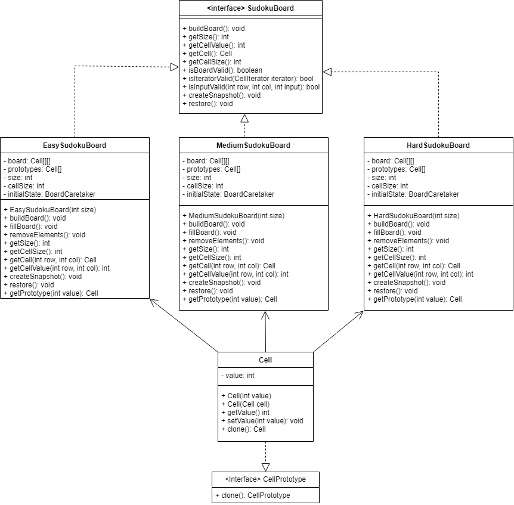

# Prototype Design Pattern for Sudoku

## What is the Prototype Design Pattern?
The prototype design pattern is a creational design pattern that allows for the creation of objects by closing existing ones, rather than reconstruction using a constructor. This allows for duplicate objects to be created as clones, removing the need to instantiate each new object individually. This pattern is useful in situations where the creation of objects is often replicated several times, cloning instead of creating new objects can increase performance.

### **Benefits to the Prototype Design Pattern:**
- Remove repeated initialization code
- Produce complex objects more conveniently

## How is it used in the Sudoku Program?
The prototype design pattern has been used to clone cell objects that have already been created with the same inputs beforehand. For example, if a cell was generated with a value of 9 already, then a future cell with a value of 9 is a clone of the previous rather than a brand new cell. This is done by creating a prototype interface, which declares a method for cell objects to clone
```java
public interface CellPrototype {
    public CellPrototype clone();
}
```

The cell class implements the CellProtoype class and implements the clone method as follows
```java
public class Cell implements CellPrototype{
    private int value;

    public Cell(int value) {
        this.value = value;
    }

    public Cell(Cell cell){
        this.value = cell.getValue();
    }
    
    public int getValue() {
        return value;
    }

    public void setValue(int value) {
        this.value = value;
    }

    public Cell clone(){
        return new Cell(this);
    }
}
```

This method is then used within each SudokuBoard object to create cells for the board. A reference array of already generated Cells is stored in the program, which is referenced each time a new cell is to be created, if the value already exists in the array then the object is cloned instead of creating a new one. Otherwise, a new value is generated for the array and stored. Below is the code used in each SudokuBoard object to clone:
```java
private Cell[] prototypes;

 /** Builds a sudoku board */
    public void buildBoard() {
        // Initialize board to 0s
        for (int row = 0; row < size; row++) {
            for (int col = 0; col < size; col++) {
                board[row][col] = getPrototype(0);
            }
        }
        // Use backtracking to fill board
        fillBoard(0, 0);
        // Remove Elements
        removeElements();
    }
    
    /** Uses backtracking to fill the board */
    private boolean fillBoard(int row, int col) {
        // Base Case, Board Filled
        if (row == size) {
            return true;
        }

        // If we have reached the end of a row, move to the next row
        if (col == size) {
            return fillBoard(row + 1, 0);
        }

        // If the current col is already filled, move to the next col
        if (board[row][col].getValue() != 0) {
            return fillBoard(row, col + 1);
        }

        // Try values from 1 to size in the current cell
        Random rand = new Random();
        for (int i = 1; i <= size; i++) {
            int value = rand.nextInt(size) + 1;
            if (isInputValid(row, col, value)) {
                board[row][col] = getPrototype(value);
                if (fillBoard(row, col + 1)) {
                    return true;
                }
            }
        }
        // If no value worked, reset the cell and backtrack
        board[row][col] = getPrototype(0);
        return false;
    }
    
    
    /** Gets a prototype of a Cell with the given value, or creates a new prototype */
    private Cell getPrototype(int value) {
        if (prototypes == null) {
            prototypes = new Cell[size];
            prototypes[0] = new Cell(0);
        }
        if(value == 0){
            return prototypes[0].clone();
        }
        if (prototypes[value - 1] == null) {
            prototypes[value - 1] = new Cell(value);
        }
        return prototypes[value - 1].clone();
    }
```

## Why have we used it?
We have applied the prototype design pattern to create cell objects, as creating new objects is a process that can take a long time when lots of them are to be generated. This can especially be seen in the 16x16 board where 256 cells are to be created. The use of prototyping allows for that board to need to only create 16 unique cells, the remaining 240 could then be cloned from those values.

# UML

