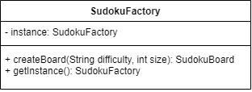

# Singleton Design Pattern for Sudoku

## What is the Singleton Design Pattern?
The Singleton design pattern is a creational design pattern that ensures a class only has one instance active while providing a global access point to this instance. The singleton pattern restricts instantiation, by only allowing access to objects through their getInstance method, which returns the only existing instance of the object, or creates the instance to be used for future calls to getInstance. This is done by defining the getInstance method, which returns the instance of the class it is being called from. The instance is stored as an instance variable and can be stored using either lazy or early initialization. In lazy initialization, the instance is initialized the first time getInstance is called, this is useful when the instance will not be necessary immediately after the program loads and is to be used later on. Early initialization creates the instance in the instance variable, meaning getInstance will not need to create it later on. This could be useful if you need immediate access to the variable. It is useful when there should only be one instance of a certain object at a time.

## How is it used in the Sudoku Program?
In the Sudoku program, it is used to ensure there is only one instance of the SudokuFactory class created at a time. This is done through the addition of the aforementioned getInstance method to the SudokuFactory class, a SudokuFactory instance variable, and the constructor has been made private. 
Below is the code for the SudokuFactory, which makes use of the Singleton design pattern.
### **SudokuFactory Code**
```java
public class SudokuFactory {
    private static SudokuFactory instance;
    private SudokuFactory(){}
    
    public static SudokuFactory getInstance(){
        if(instance == null){
            instance = new SudokuFactory();
        }
        return instance;
    }

    public SudokuBoard createBoard(String difficulty, int size){
        if(difficulty.equals("Easy")){
            return new EasySudokuBoard(size);
        }
        else if(difficulty.equals("Medium")){
            return new MediumSudokuBoard(size);
        }
        else if(difficulty.equals("Hard")){
            return new HardSudokuBoard(size);
        }
        else{
            return null;
        }
    }
}

```

The SudokuFactory class is later used to create Sudoku Boards in the SudokuGUI class, this is done by calling the getInstance method to get the factory, then using createBoard to create a new game board. This can be seen below
### **SudokuGUI Factory Creation**
```java
        // Create sudoku board
        SudokuFactory factory = SudokuFactory.getInstance();
        sudokuBoard =  factory.createBoard(difficulty, boardSize);
```

## Why have we used it?
Global Access
- The use of the singleton pattern allows for global access to the SudokuFactory class, this allows for object creation to be easily accessible within the GUI class.

Only one Instance
- Only one instance of the SudokuFactory class is active at a time, this ensures improved performance as there will not be more than one factory in the program at a time.
- Having one instance allows for increased control over the creation of SudokuBoard objects, it can be ensured that boards are only created by the SudokuFactory class that has been retrieved through the getInstance method, this is likely to reduce conflicting or incorrect board creation.
We have used the singleton to create the SudokuFactory to ensure that object creation is consistent. 


# UML

